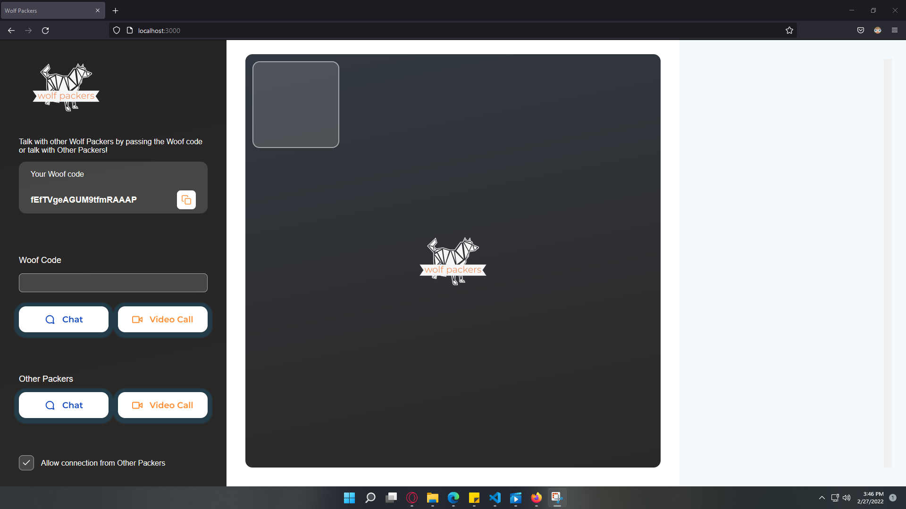
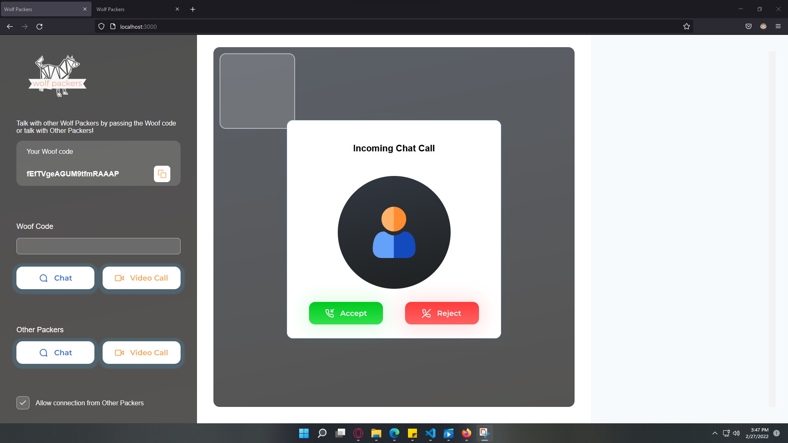

# wolf-packers


 ### Author: Balaji Guna


Link - http://localhost:3000


## Installation Nodejs

```
npm init
```

```
npm install --save express
```

```
npm install --save socket.io
```

## Installation nodemon

```
npm install nodemon
```

## How to use 

```
npm install
```

```
npm start
```

## WebRTC Omegle clone


## Calling Screen

